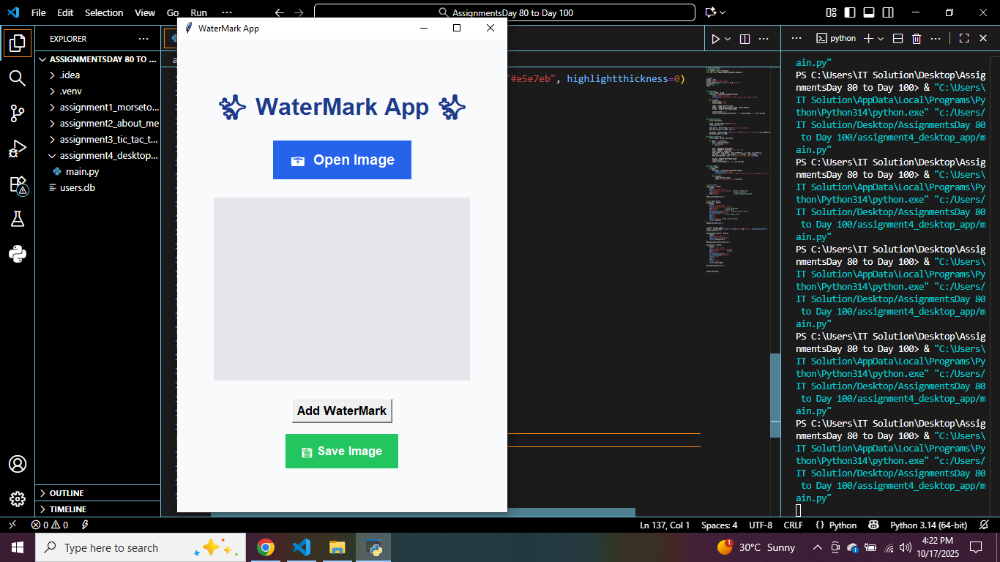
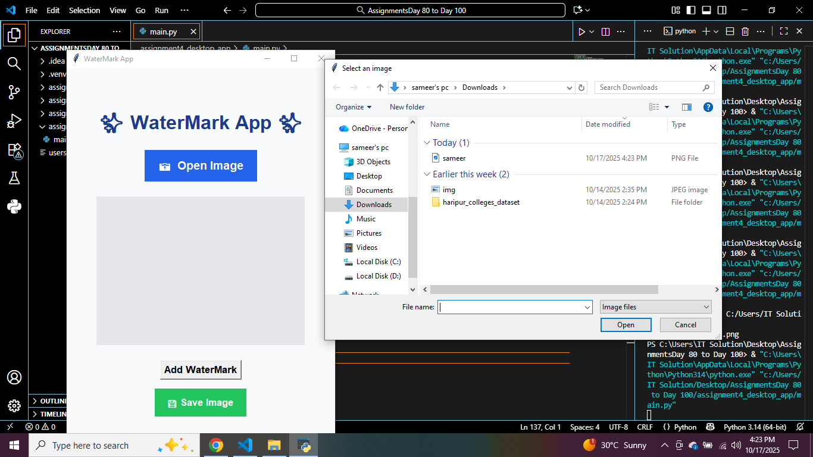
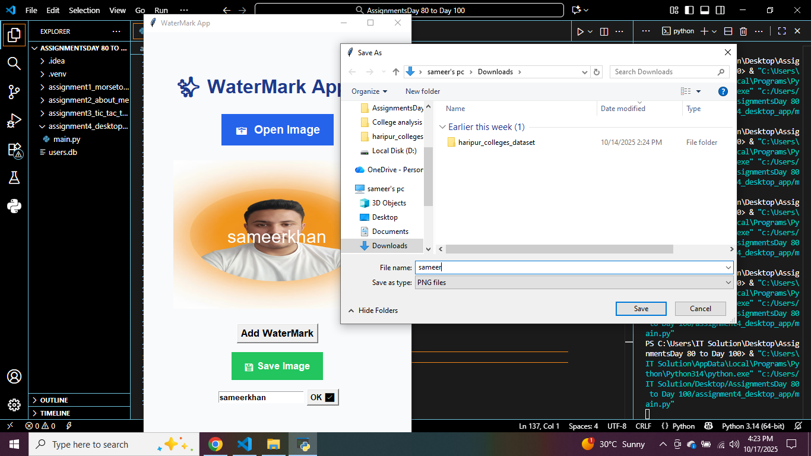

# Img-WaterMark-Desktop-Application-in-Python-With-Tkinter
🖼️ Watermark Adder — Desktop Application (Tkinter)  A simple yet powerful desktop application built with Python (Tkinter) that allows users to add custom watermarks (text ) to their images with just a few clicks.

## 🖼️ Application Interface

### 🏠 Home Screen
#
The home screen of the app shows a clean layout with buttons to **open**, **add watermark**, and **save** your image.  
It uses a soft background color and a clear title — **“✨ WaterMark App ✨”** — to keep things simple and modern.

---

### 📂 Open Image
#
When you click **📷 Open Image**, a file dialog appears allowing you to select an image from your computer.  
Supported formats include **JPG, PNG, JPEG, BMP, and GIF**.  
Once selected, the image is displayed neatly on the canvas for preview.

---

### 💧 Add Watermark
#
After the image loads, click **Add WaterMark**.  
An entry box appears where you can type your custom text — such as your name or brand.  
When you press **OK ✅**, the app automatically centers the watermark on the image using `PIL.ImageDraw` and `ImageFont`.

---

### 💾 Save Image
#
When you’re happy with your watermark, click **💾 Save Image**.  
A save dialog will open — choose where to store your new watermarked image.  
The image is saved in high quality (`.png` by default), ready to share or upload.

---
